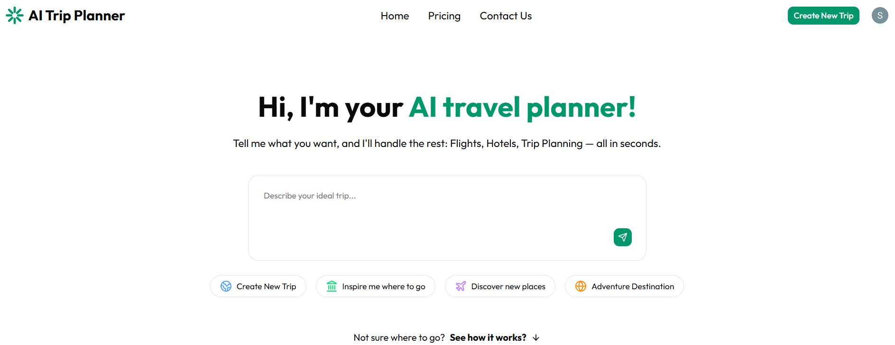
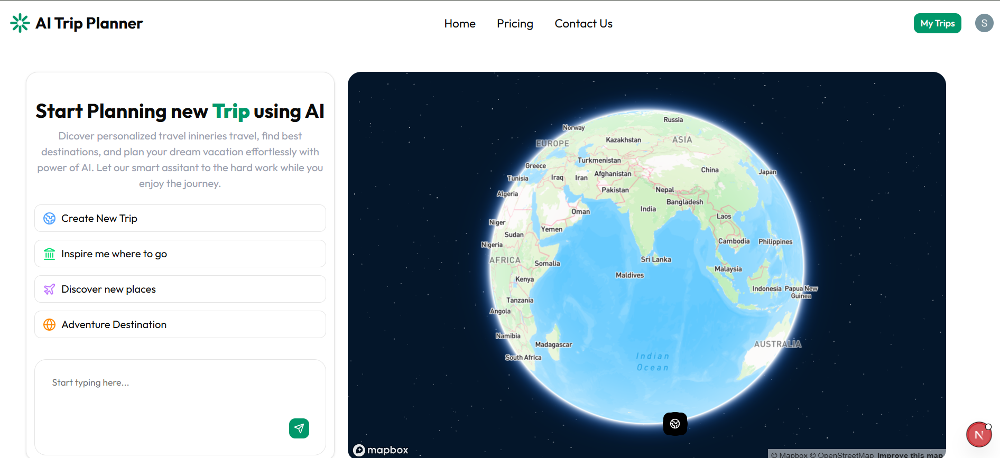
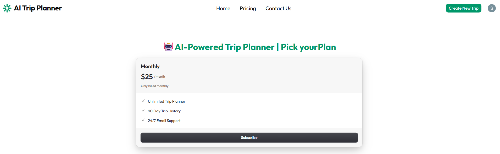

# AI Trip Planner

An AI-powered full-stack travel planning application that helps users create personalized trips based on their destination, travel preferences, duration, and budget.

The application combines AI-powered itinerary generation with authentication, trip management, location data, and a responsive modern interface.

## Preview

### Home



### Create a Trip



### Pricing



## Features

* AI-powered personalized trip planning
* Generate travel itineraries based on user preferences
* Destination and place information
* User authentication and account management
* Save and manage previously created trips
* Dedicated trip detail pages
* Responsive user interface
* Pricing page
* Secure API integration
* Modern component-based architecture

## Tech Stack

### Frontend

* **Next.js**
* **React**
* **TypeScript**
* **Tailwind CSS**
* **shadcn/ui**
* **Lucide React**
* **Tabler Icons**
* **Motion**

### Backend & Data

* **Convex** — backend and data management
* **Next.js API Routes** — server-side API functionality
* **Axios** — HTTP requests
* **UUID** — unique identifiers

### AI & APIs

* **OpenAI API** — AI-powered trip generation
* **Google Places API** — place and location information
* **Mapbox GL** — map and location visualization

### Authentication & Security

* **Clerk** — authentication and user management
* **Arcjet** — application security and protection

## Application Flow

```text
User
  ↓
Selects destination & travel preferences
  ↓
Trip creation request
  ↓
AI processes the travel requirements
  ↓
Personalized itinerary is generated
  ↓
Trip details are displayed
  ↓
User can save and manage the trip
```

## Main Pages

| Page               | Purpose                                        |
| ------------------ | ---------------------------------------------- |
| Home               | Introduces the AI Trip Planner                 |
| Create New Trip    | Collects travel preferences and creates a trip |
| View Trip          | Displays the generated trip and itinerary      |
| My Trips           | Allows users to manage their saved trips       |
| Pricing            | Displays available pricing information         |
| Sign In / Sign Up  | User authentication                            |
| Account Management | Manage user account settings                   |

## Project Structure

```text
ai-trip-planner-web-app/
│
├── app/
│   ├── api/
│   │   ├── aimodel/
│   │   └── google-place-detail/
│   │
│   ├── create-new-trip/
│   ├── my-trips/
│   ├── pricing/
│   ├── sign-in/
│   ├── sign-up/
│   ├── view-trip/
│   └── ...
│
├── components/
│   └── ui/
│
├── context/
│
├── convex/
│
├── hooks/
│
├── lib/
│
├── public/
│   ├── home.png
│   ├── create-trip.png
│   └── pricing.png
│
├── middleware.ts
├── next.config.ts
├── package.json
├── tsconfig.json
└── README.md
```

## Getting Started

### Prerequisites

Make sure you have installed:

* Node.js
* npm
* Git

### 1. Clone the repository

```bash
git clone https://github.com/shrutikotgire0129/ai-trip-planner-web-app.git
```

### 2. Navigate to the project

```bash
cd ai-trip-planner-web-app
```

### 3. Install dependencies

```bash
npm install
```

### 4. Configure environment variables

Create a `.env.local` file in the root directory and add the required API keys and configuration values.

Example:

```env
# Authentication
NEXT_PUBLIC_CLERK_PUBLISHABLE_KEY=
CLERK_SECRET_KEY=

# AI
OPENAI_API_KEY=

# Database / Backend
CONVEX_DEPLOYMENT=
NEXT_PUBLIC_CONVEX_URL=

# Maps / Places
NEXT_PUBLIC_MAPBOX_TOKEN=
GOOGLE_PLACE_API_KEY=

# Security
ARCJET_KEY=
```

> Never commit `.env.local` or any file containing secret API keys to GitHub.

### 5. Start the development server

```bash
npm run dev
```

Open:

```text
http://localhost:3000
```

## Available Scripts

```bash
npm run dev
```

Runs the application in development mode.

```bash
npm run build
```

Creates an optimized production build.

```bash
npm run start
```

Starts the application in production mode after building.

## Environment Variables

The application uses environment variables for external services such as:

* Clerk authentication
* OpenAI
* Convex
* Google Places
* Mapbox
* Arcjet

API keys should always be stored in environment variables and should never be committed to the repository.

## What I Built

This project demonstrates the implementation of a modern AI-powered full-stack web application using Next.js and TypeScript.

The project focuses on combining:

* AI integration
* API development
* Authentication
* Backend/data management
* Third-party service integration
* Responsive UI development
* Component-based architecture
* Secure handling of API credentials

## Future Improvements

* Add more advanced itinerary customization
* Improve AI-generated recommendations
* Add trip sharing
* Add collaborative trip planning
* Add more travel and booking integrations
* Improve recommendation personalization
* Add richer map interactions
* Add automated testing

## Learning Outcomes

Through this project, I worked with modern full-stack development concepts including:

* Next.js App Router
* React and TypeScript
* API integration
* AI API integration
* Authentication
* Backend/data management
* Environment variable management
* Responsive UI development
* Third-party API integration
* Production build and deployment workflows

## Author

**Shruti Kotgire**

B.Tech Graduate | Software Developer | UI/UX Designer

GitHub: [@shrutikotgire0129](https://github.com/shrutikotgire0129)

---

If you find this project useful, consider giving the repository a star.
